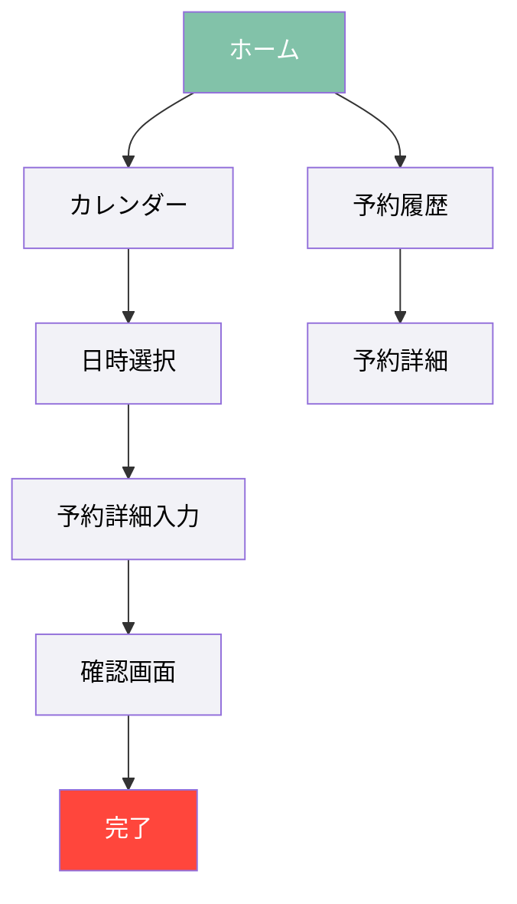

# 撮影スタジオ予約管理アプリケーション デザイン仕様書

## 1. カラーパレット（Apple HIG準拠）

### 1.1 メインカラー
**ミントグリーン**: `#82C2A9`
- 落ち着きと清潔感を与え、長時間使用しても目に優しい
- Apple UIの基本理念である「明快さ」と「洗練された美しさ」に調和

### 1.2 追加カラー
**1. アクセントカラー（レッド）**: `#FF463C`
- 予約確定ボタンや重要通知など、ユーザーのアクションを促す要素に使用
- Apple製品でよく使われる赤色アクセントに近い色味で、ユーザーに馴染みやすい

**2. システムグレー**: `#8E8E93`
- Apple HIG推奨のシステムグレーに近い色味
- 二次的な情報やアイコンに使用

**3. バックグラウンドカラー**: `#F2F2F7`
- Apple標準のライトモードの背景色に近い色調
- 長時間の使用でも目の疲労を軽減

**4. セパレータカラー**: `#C6C6C8`
- リスト間の区切りやセクション分けに使用
- Apple HIG準拠の控えめな境界線表現

## 2. Apple HIGに沿ったデザイン原則

### 2.1 デザイン哲学

**1. 明瞭さ（Clarity）**
- 機能が明確で理解しやすいUI要素
- 必要最小限のコントロールと情報表示
- テキストの高い可読性を確保

**2. 尊重（Deference）**
- コンテンツを中心に考えたUI設計
- 必要以上の装飾を避け、機能性を優先
- ユーザーの操作をスムーズにするミニマルなデザイン

**3. 深度（Depth）**
- 視覚階層による情報の整理
- レイヤードUIによる明確な操作コンテキスト
- 適切なアニメーションによる状態遷移の可視化

### 2.2 具体的なUI要素デザイン

**1. ナビゲーション**
- タブバースタイルのメインナビゲーション（予約、マイページ、設定など）
- 階層型ナビゲーションによる直感的な画面遷移
- カレンダー表示と予約リスト表示の切り替えを容易に

**2. ボタン**
- Apple標準のボタンデザインに準拠
  - プライマリアクション：`#82C2A9`（メインカラー）の角丸ボタン
  - セカンダリアクション：境界線のみのアウトラインボタン
  - 重要アクション（予約確定など）：`#FF463C`（アクセントカラー）

**3. テーブルビューとリスト**
- Apple標準のリスト表示スタイル
- カード表示とリスト表示の適切な使い分け
- スワイプアクションによる予約の変更・キャンセル機能

**4. フォーム要素**
- iOS/macOSネイティブ風の入力フォーム
- セグメントコントロールを使った選択肢の提示（例：仮予約/本予約の切り替え）
- スライダーやピッカーを効果的に活用

**5. タイポグラフィ**
- システムフォント（San Francisco）に準拠したフォントファミリー
- 日本語表示には「ヒラギノ角ゴ」または「SF Pro JP」を採用
- 動的タイプに対応（ユーザーの設定したフォントサイズに合わせて調整）

## 3. アクセシビリティへの配慮

- ダイナミックタイプ対応（フォントサイズ変更に対応）
- 色覚多様性に配慮（色だけでなく形状やラベルでも情報を伝達）
- VoiceOver対応で視覚障害ユーザーにも使いやすいUI
- 十分なタッチターゲットサイズ（最小44×44ポイント）

## 4. デバイス別最適化

### 4.1 iPhone/スマートフォン
- 片手操作に配慮した要素配置
- 下部に主要コントロールを配置
- プルダウンリフレッシュやスワイプジェスチャーの活用

### 4.2 iPad/タブレット
- 分割ビューの活用（左側にカレンダー、右側に詳細情報）
- ポップオーバーを使用した効率的な情報表示
- Apple Pencil対応（カレンダーへの書き込みメモ機能など）

### 4.3 Mac/デスクトップ
- サイドバーナビゲーションの活用
- ショートカットキー対応
- 複数ウィンドウ操作の最適化

## 5. 主要画面のデザインコンセプト

### 5.1 ホーム画面/ダッシュボード
- 今日の予約状況を中央に大きく表示
- 次の予約までのカウントダウン
- クイックアクセスボタンで主要機能に素早くアクセス

### 5.2 カレンダー画面
- Apple カレンダーに近い直感的なレイアウト
- 予約状態を色分けで表示（空き、仮予約、確定予約）
- 月表示、週表示、日表示の切り替えをセグメントコントロールで実現

### 5.3 予約フォーム
- ステップバイステップの予約プロセス
- フォームの入力状態をプログレスインジケーターで可視化
- 入力の即時バリデーション

### 5.4 通知センター
- Apple通知センターの設計原則に従った整理された通知表示
- 優先度による通知のグループ化
- アクション可能な通知（承認、拒否などのインラインアクション）

## 6. ユーザー体験の向上ポイント

### 6.1 予測可能性と一貫性
- すべての画面で一貫したインタラクションパターン
- Apple製品に慣れたユーザーにとって学習コストが低い
- システム全体で統一された動作と見た目

### 6.2 フィードバックとユーザーガイド
- 操作に対する即時フィードバック
- エラー状態の明確な表示と回復方法の提示
- コンテキストヘルプの提供

### 6.3 効率性
- 最小限のステップで予約完了
- よく使う機能へのショートカット
- スマートデフォルト値の提供

## 7. デザインの実装方針

### 7.1 コンポーネントベースの設計
- 再利用可能なUIコンポーネントライブラリの構築
- 一貫したデザイン要素の管理と適用
- テーマの一元管理によるブランドの統一性確保

### 7.2 レスポンシブデザインアプローチ
- デバイス間で一貫した体験を提供
- 異なる画面サイズに適応するフレキシブルなレイアウト
- コンテンツ優先のアダプティブデザイン

### 7.3 プロトタイピングとユーザーテスト
- 初期デザインの検証とイテレーション
- 主要ユーザーフローの検証
- アクセシビリティとユーザビリティの包括的なテスト

## 8. ビジュアルデザインサンプル

このデザイン仕様書は、Appleのヒューマンインターフェースガイドラインに沿った、使いやすく美しいアプリケーションの構築を目指しています。ユーザーにとって馴染みのあるUIパターンを採用しつつ、撮影スタジオ予約という特定の目的に最適化されたデザインとなっています。
