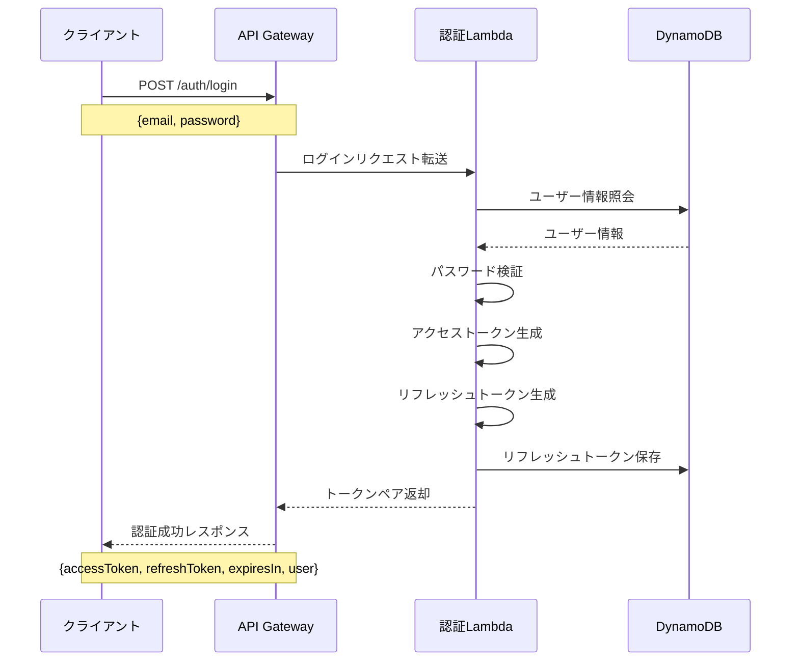
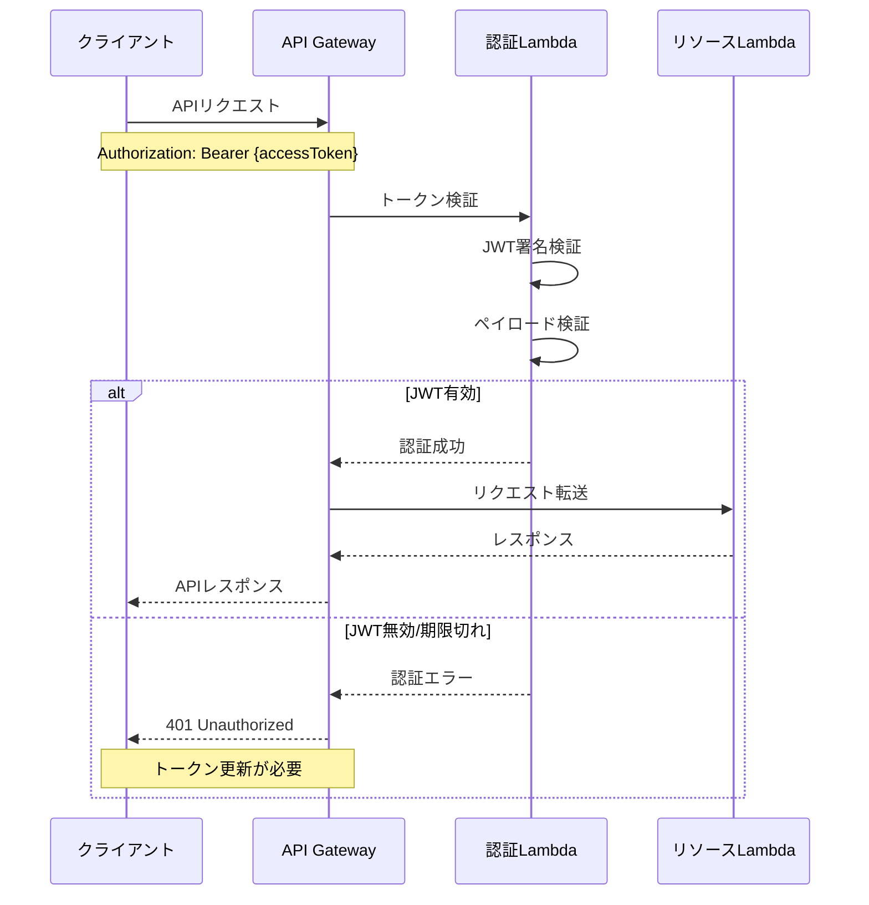
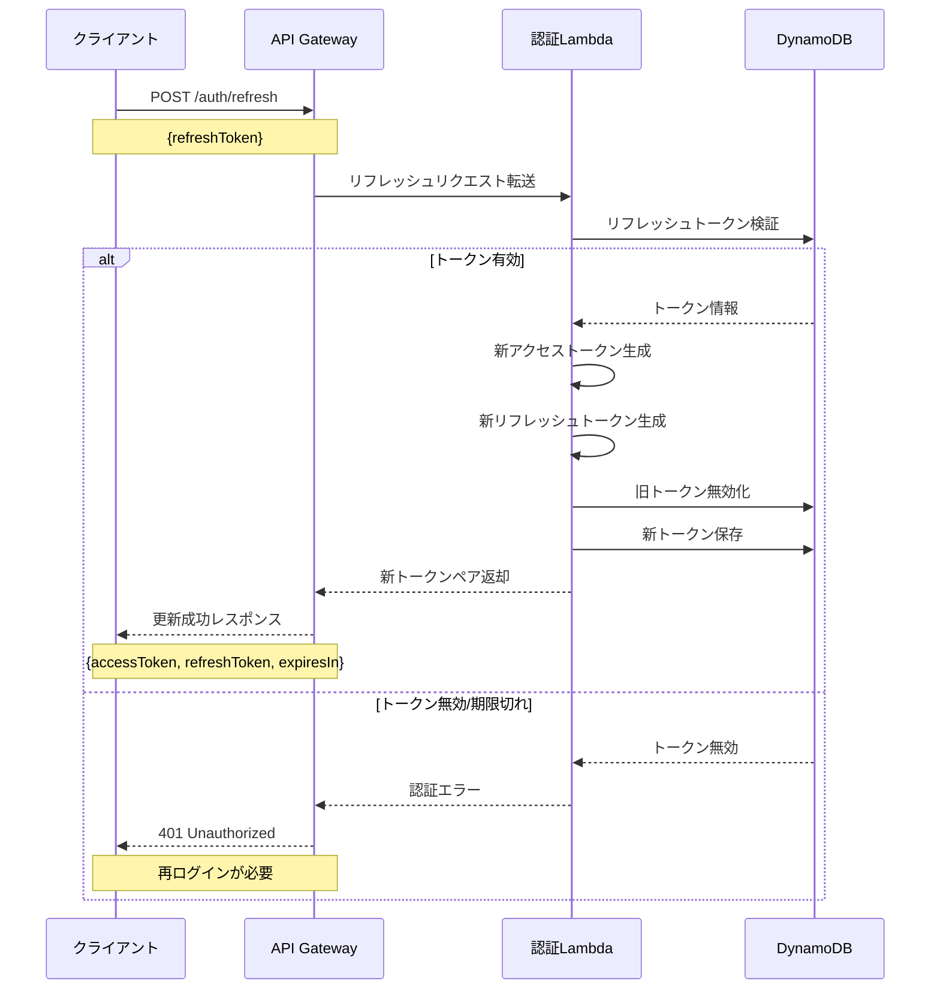
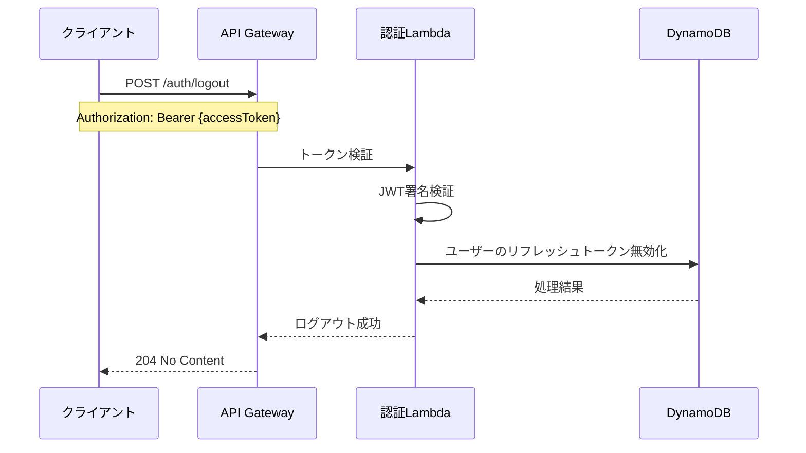

# JWT認証フロー詳細設計

## 1. 認証システム概要

撮影スタジオ予約管理アプリケーションでは、JWTベースの認証システムを採用し、サーバーレスアーキテクチャでセキュアかつスケーラブルな認証機能を提供します。本設計では、アクセストークンとリフレッシュトークンを使用した二段階のトークン管理システムを実装します。

## 2. トークン設計

### 2.1 アクセストークン

**目的**: APIリクエストの認証、短期間有効

**特性**:
- **形式**: JWT (JSON Web Token)
- **署名アルゴリズム**: RS256（非対称暗号）
- **有効期限**: 1時間（3,600秒）
- **発行者**: `api.studio-booking.example.com`

**ペイロード構造**:
```json
{
  "iss": "api.studio-booking.example.com",
  "sub": "<userId>",
  "email": "<userEmail>",
  "name": "<userName>",
  "isAdmin": false,
  "exp": 1721140800,
  "iat": 1721137200,
  "jti": "<unique-token-id>"
}
```

**セキュリティ設定**:
- 署名検証に公開鍵を使用（AWS KMS）
- 期限切れトークンは自動的に無効
- ステートレス検証（データベース参照なし）

### 2.2 リフレッシュトークン

**目的**: 新しいアクセストークンの取得、長期間有効

**特性**:
- **形式**: UUID v4 + ハッシュ
- **保存場所**: DynamoDB（ハッシュ化して保存）
- **有効期限**: 30日
- **使い捨て**: 一度使用したら無効化（トークンローテーション）

**保存情報**:
```json
{
  "tokenId": "<hashed-refresh-token>",
  "userId": "<userId>",
  "issuedAt": "2025-06-01T10:00:00Z",
  "expiresAt": "2025-07-01T10:00:00Z",
  "isRevoked": false,
  "clientInfo": {
    "ip": "192.168.1.1",
    "userAgent": "Mozilla/5.0 ..."
  }
}
```

**セキュリティ設定**:
- BCryptでハッシュ化して保存
- リフレッシュトークンファミリー方式で追跡
- 不審な使用パターンを検出して自動的に無効化

## 3. 認証フロープロセス

### 3.1 初回ログインフロー



### 3.2 APIリクエスト認証フロー



### 3.3 トークン更新フロー



### 3.4 ログアウトフロー



## 4. セキュリティ対策

### 4.1 トークンセキュリティ

1. **署名検証**
   - RS256アルゴリズムで署名（非対称暗号）
   - 秘密鍵はAWS KMSで管理
   - 公開鍵のみをAPI Gatewayで使用

2. **JWTクレームセキュリティ**
   - `exp`（有効期限）: 必須
   - `nbf`（Not Before）: 発行時間から数秒後に設定
   - `jti`（JWT ID）: ランダムなUUIDを使用
   - `iss`（Issuer）: ドメイン名を指定

3. **トークン伝送保護**
   - HTTPSのみを許可
   - Authorization ヘッダーのみで受け付け
   - Cookieでの伝送は使用しない

### 4.2 リフレッシュトークンセキュリティ

1. **トークンローテーション**
   - リフレッシュトークン使用時に毎回新トークンを発行
   - 旧トークンは即時無効化
   - トークンチェーン（ファミリー）を追跡

2. **盗難検知**
   - 同一ファミリーの不正使用検知
   - 不審な使用パターンで全てのトークンを無効化
   - クライアント情報（IPアドレス、User-Agent）の比較

3. **絶対的有効期限**
   - リフレッシュトークンの絶対期限（30日間）
   - 期限経過後は再ログインを強制

### 4.3 認証Lambda セキュリティ

1. **レート制限**
   - API GatewayでIP単位のレート制限を設定
   - ログイン試行回数の制限（5分間に5回まで）

2. **パスワードセキュリティ**
   - BCryptによるセキュアなハッシュ化
   - ソルト自動生成
   - ストレッチングファクター: 12

3. **異常検知**
   - 短時間での複数回ログイン失敗の検知
   - 地理的に離れた場所からの同時アクセスの検知
   - CloudWatchアラームとの連携

## 5. エラーハンドリング

### 5.1 認証エラー種類

| エラーコード | 説明 | HTTPステータス |
|------------|------|--------------|
| `INVALID_CREDENTIALS` | メールアドレスまたはパスワードが正しくありません | 401 |
| `ACCOUNT_LOCKED` | アカウントがロックされています（複数回認証失敗） | 403 |
| `TOKEN_EXPIRED` | アクセストークンの期限が切れています | 401 |
| `INVALID_TOKEN` | 無効なトークン形式または署名 | 401 |
| `REFRESH_TOKEN_EXPIRED` | リフレッシュトークンの期限が切れています | 401 |
| `REVOKED_TOKEN` | すでに無効化されたトークン | 401 |
| `INSUFFICIENT_SCOPE` | 必要な権限がありません | 403 |

### 5.2 エラーレスポンス形式

```json
{
  "code": "TOKEN_EXPIRED",
  "message": "アクセストークンの有効期限が切れています。リフレッシュしてください。",
  "timestamp": "2025-06-15T10:30:00Z",
  "requestId": "req-123456"
}
```

## 6. 実装詳細

### 6.1 AWS Lambda関数構成

**認証Lambdaパッケージ**:
- `registerHandler` - ユーザー登録処理
- `loginHandler` - ログイン処理
- `refreshHandler` - トークン更新処理
- `logoutHandler` - ログアウト処理
- `authorizer` - APIリクエスト認証（API Gateway Authorizer）
- `tokenService` - トークン生成・検証共通モジュール
- `passwordService` - パスワード検証共通モジュール

### 6.2 トークン生成と検証

**アクセストークン生成**:
```go
func generateAccessToken(user User) (string, error) {
    now := time.Now()
    claims := jwt.MapClaims{
        "iss":     "api.studio-booking.example.com",
        "sub":     user.ID,
        "email":   user.Email,
        "name":    user.FullName,
        "isAdmin": user.IsAdmin,
        "exp":     now.Add(time.Hour).Unix(),
        "iat":     now.Unix(),
        "nbf":     now.Add(time.Second * 2).Unix(), // 2秒の猶予
        "jti":     uuid.New().String(),
    }
    
    token := jwt.NewWithClaims(jwt.SigningMethodRS256, claims)
    return token.SignedString(privateKey)
}
```

**アクセストークン検証**:
```go
func validateAccessToken(tokenString string) (*jwt.Token, jwt.MapClaims, error) {
    token, err := jwt.Parse(tokenString, func(token *jwt.Token) (interface{}, error) {
        if _, ok := token.Method.(*jwt.SigningMethodRSA); !ok {
            return nil, fmt.Errorf("unexpected signing method: %v", token.Header["alg"])
        }
        return publicKey, nil
    })
    
    if err != nil {
        return nil, nil, err
    }
    
    if !token.Valid {
        return nil, nil, errors.New("invalid token")
    }
    
    claims, ok := token.Claims.(jwt.MapClaims)
    if !ok {
        return nil, nil, errors.New("invalid claims")
    }
    
    return token, claims, nil
}
```

### 6.3 トークン管理データベース設計

**RefreshTokensテーブル**:

```
テーブル名: studio-booking-refresh-tokens

プライマリキー:
- パーティションキー (PK): tokenId (String) - ハッシュ化されたトークン

GSI:
- ユーザーID索引:
  - パーティションキー: userId (String)
  - ソートキー: expiresAt (String)
```

### 6.4 Authorizerの設計

AWS API Gateway用のLambdaオーソライザーを実装し、トークン検証とアクセス制御を行います。

```go
func handleRequest(ctx context.Context, event events.APIGatewayCustomAuthorizerRequest) (events.APIGatewayCustomAuthorizerResponse, error) {
    token := extractToken(event.AuthorizationToken)
    
    // トークン検証
    _, claims, err := validateAccessToken(token)
    if err != nil {
        return generatePolicy("user", "Deny", event.MethodArn), nil
    }
    
    // ポリシー生成
    userId := claims["sub"].(string)
    isAdmin := claims["isAdmin"].(bool)
    
    // 管理者権限のチェック（必要に応じて）
    if strings.Contains(event.MethodArn, "/admin/") && !isAdmin {
        return generatePolicy(userId, "Deny", event.MethodArn), nil
    }
    
    // アクセス許可
    return generatePolicy(userId, "Allow", event.MethodArn), nil
}
```

## 7. 開発・デプロイフロー

### 7.1 ローカル開発環境

1. **秘密鍵/公開鍵ペアの生成**
   ```bash
   ssh-keygen -t rsa -b 4096 -m PEM -f jwtRS256.key
   openssl rsa -in jwtRS256.key -pubout -outform PEM -out jwtRS256.key.pub
   ```

2. **環境変数設定**
   ```
   JWT_PRIVATE_KEY=file://./jwtRS256.key
   JWT_PUBLIC_KEY=file://./jwtRS256.key.pub
   TOKEN_ISSUER=api-dev.studio-booking.example.com
   ACCESS_TOKEN_TTL=3600
   REFRESH_TOKEN_TTL=2592000
   ```

### 7.2 AWS環境デプロイ

1. **KMSでの秘密鍵管理**
   - AWS KMSで秘密鍵を安全に保存
   - 認証Lambda関数のみがアクセス可能

2. **API Gateway設定**
   - Lambda AuthorizerをAPI Gateway統合
   - すべてのエンドポイントでオーソライザーを適用（認証エンドポイント除く）

3. **AWS Secrets Managerの活用**
   - トークン検証用の公開鍵を保存
   - 環境ごとに異なる設定を管理

## 8. 認証フローの最適化

### 8.1 トークンキャッシュ

1. **API Gateway Authorizerキャッシュ**
   - TTL: 300秒（5分間）
   - アクセストークンをキャッシュキーとして使用

2. **フロントエンドキャッシュ**
   - LocalStorageまたはMemoryにアクセストークンを保存
   - セキュリティ対策としてMemorySotrage推奨

### 8.2 アクセス権チェック最適化

1. **クレームベース権限チェック**
   - JWTペイロードに基本的な権限情報を含める
   - 頻繁に変更されない権限のみ
   
2. **詳細権限のデータベース参照**
   - 特殊権限や動的に変更される権限
   - DynamoDBへの読み取り最適化

### 8.3 バッチトークン無効化

リフレッシュトークンの定期的な整理と無効化：

1. **EventBridgeスケジュールイベント**
   - 毎日深夜に実行
   - 期限切れトークンの削除
   - 一定期間未使用トークンの無効化

2. **セキュリティイベント発生時**
   - パスワード変更時
   - 不審なアクティビティ検出時
   - ユーザーからの要求時

## 9. 運用とモニタリング

### 9.1 ログ記録

1. **認証イベントログ**
   - ログイン成功/失敗
   - トークン更新
   - アクセス拒否
   - 監査目的での完全なログ

2. **フィルタリング**
   - 機密情報（パスワード、トークン全体）はマスク
   - 最小限のPIIのみを記録

### 9.2 アラート

1. **セキュリティアラート**
   - 短時間での多数の認証失敗
   - 地理的に離れた場所からの同時ログイン
   - 管理者アカウントへの不審なアクセス試行

2. **パフォーマンスアラート**
   - 認証Lambda関数の実行時間上昇
   - エラー率の急増
   - トークン検証のエラー率上昇

### 9.3 監視ダッシュボード

認証システム健全性を監視するCloudWatchダッシュボード：

1. **メトリクス**
   - ログイン成功/失敗率
   - トークン検証成功/失敗率
   - 平均認証処理時間
   - アクティブトークン数

2. **インサイト**
   - 時間帯別ログイン傾向
   - エラーパターン分析
   - 地理的アクセス分布

## 10. ベストプラクティスと考慮事項

### 10.1 セキュリティベストプラクティス

1. **トークン保存のセキュリティ**
   - フロントエンド: HttpOnlyクッキー不可のためメモリに保存を推奨
   - バックエンド: 常にハッシュ化して保存、平文での保存禁止

2. **鍵のローテーション**
   - JWT署名鍵の定期的なローテーション（90日ごと）
   - ローテーション中の互換性維持（旧鍵での検証も期間限定で許可）

3. **トークン漏洩対策**
   - 絶対的なトークン有効期限の設定
   - クライアント情報（指紋）の検証
   - 異常な使用パターンの検出

### 10.2 拡張性考慮事項

1. **複数認証方式対応**
   - 将来的なソーシャルログイン追加を考慮
   - 多要素認証（MFA）の実装準備
   - 認証プロバイダーの追加容易性

2. **ユーザー数の拡大**
   - DynamoDBのスケーリング計画
   - Lambda関数の同時実行数設定
   - キャッシュ戦略の最適化

### 10.3 規制対応

1. **プライバシー法令対応**
   - GDPR: 最小限のデータ収集
   - 個人データの適切な保護
   - ログインセッションの明示的な管理

2. **監査と追跡**
   - 重要認証イベントの完全監査証跡
   - アカウント変更の履歴保持
   - セキュリティイベントの記録

## 11. テスト戦略

### 11.1 ユニットテスト

1. **トークン生成/検証のテスト**
   - 有効トークン生成の検証
   - 署名検証の確認
   - エラーケースのテスト

2. **認証ロジックのテスト**
   - パスワード検証
   - 不正パターン検出
   - エラーハンドリング

### 11.2 統合テスト

1. **エンドツーエンド認証フロー**
   - 登録→ログイン→トークン更新→ログアウト
   - 異常系テスト（不正トークン、期限切れ）
   - 同時リクエスト処理

2. **Lambda統合テスト**
   - API Gateway + Lambda Authorizer
   - DynamoDBとの連携テスト
   - KMS鍵利用のテスト

### 11.3 負荷テスト

1. **認証サービスの限界テスト**
   - 同時多数の認証リクエスト
   - 短時間での大量トークン検証
   - コールドスタート影響の測定

このJWT認証フローの詳細設計に基づき、セキュアでスケーラブルな認証システムを実装することで、撮影スタジオ予約管理アプリケーションのユーザー認証を堅牢に保護します。
