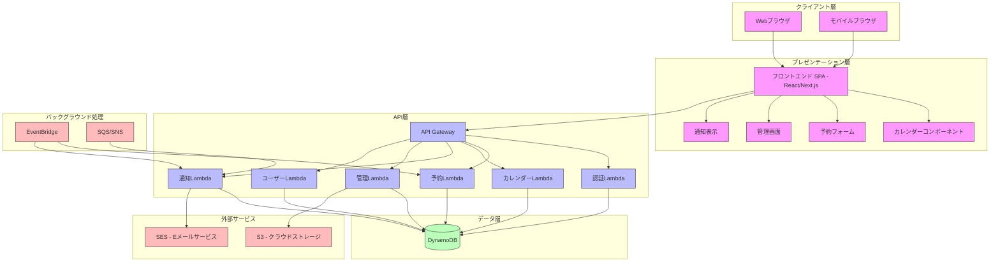
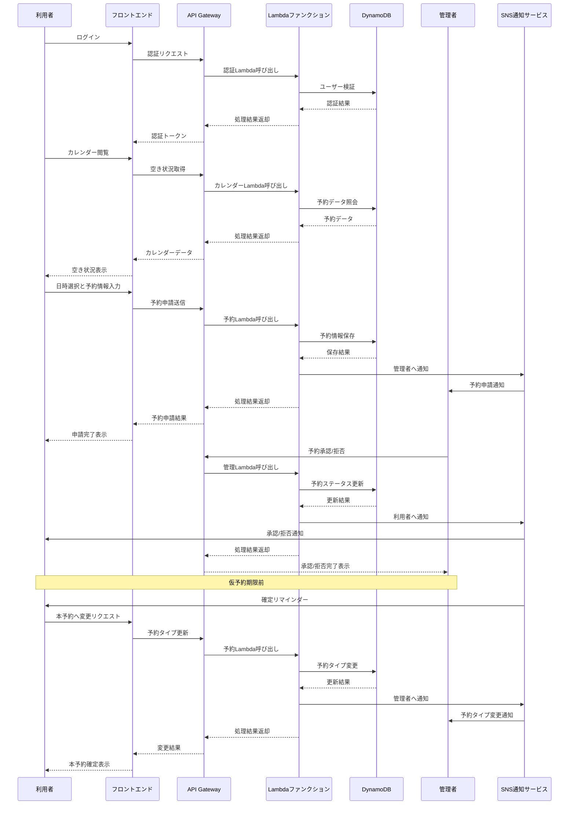
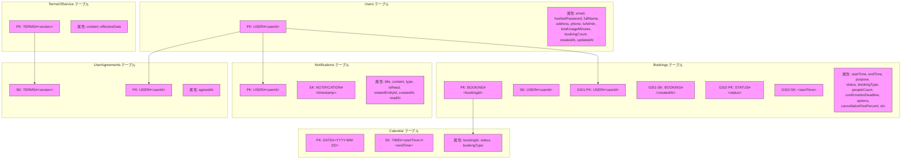

# 撮影スタジオ予約管理アプリケーション システムアーキテクチャ図

## 1. 全体システム構成図



## 2. 予約フロー図



## 3. DynamoDBデータモデル設計

### 主要テーブル構成



### アクセスパターン

1. ユーザー情報取得: `Users` テーブル - PK で GetItem
2. ユーザー予約一覧取得: `Bookings` テーブル - GSI1 で Query (PK = USER#userId)
3. 日付別の空き状況確認: `Calendar` テーブル - PK で Query (PK = DATE#YYYY-MM-DD)
4. 承認待ち予約一覧取得: `Bookings` テーブル - GSI2 で Query (PK = STATUS#pending)
5. ユーザー通知取得: `Notifications` テーブル - PK で Query (PK = USER#userId)

## 4. デプロイ・運用アーキテクチャ（AWS サーバレスとIaC）

本システムは、AWSのサーバレスサービス群を全面的に採用し、インフラストラクチャのプロビジョニングと管理はIaC（Infrastructure as Code）によって自動化されます。CI/CDパイプラインを通じて、アプリケーションコードとインフラ定義の変更が、テスト、ステージング、本番環境へ安全かつ迅速にデプロイされます。

```mermaid
graph TD
    subgraph "開発・CI/CD"
        Dev[開発者] --> Git[Gitリポジトリ]
        Git --> CI_CD[CI/CDパイプライン<br>(GitHub Actions)]
        subgraph "IaCによるプロビジョニング"
            CI_CD --> IaC{IaC<br>(CloudFormation/Terraform)}
        end
    end

    subgraph "AWS Cloud"
        subgraph "フロントエンド"
            B[CloudFront]
            C[S3 - 静的ファイル]
        end
        
        subgraph "バックエンド"
            D[API Gateway]
            E[Lambda Functions]
        end
        
        subgraph "データストア"
            G[DynamoDB]
        end
        
        subgraph "ストレージ/メッセージング"
            I[S3 - ファイルストレージ]
            J[SQS - メッセージキュー]
        end
        
        subgraph "メール/通知"
            K[SES - メール送信]
            L[SNS - 通知]
            EV[EventBridge]
        end
        
        subgraph "監視/ロギング"
            M[CloudWatch]
            N[X-Ray]
        end
    end
    
    subgraph "クライアント"
        A[Web/モバイルブラウザ]
    end

    IaC --> B; IaC --> C; IaC --> D; IaC --> E; IaC --> G;
    IaC --> I; IaC --> J; IaC --> K; IaC --> L; IaC --> EV;
    IaC --> M; IaC --> N;

    CI_CD -- "フロントエンドデプロイ" --> C
    CI_CD -- "バックエンドデプロイ" --> E
    
    A --> B
    B --> C
    A --> D
    D --> E
    E --> G
    E --> I
    E --> J
    J --> E
    E --> K
    E --> L
    EV --> E
    E --> M
    E --> N
    
    classDef cicd fill:#d4e1f5,stroke:#333,stroke-width:1px;
    classDef client fill:#f9f,stroke:#333,stroke-width:1px;
    classDef frontend fill:#bbf,stroke:#333,stroke-width:1px;
    classDef backend fill:#bfb,stroke:#333,stroke-width:1px;
    classDef data fill:#fbb,stroke:#333,stroke-width:1px;
    classDef monitoring fill:#ffb,stroke:#333,stroke-width:1px;

    class Dev,Git,CI_CD,IaC cicd;
    class A client;
    class B,C frontend;
    class D,E,J,K,L,EV backend;
    class G,I data;
    class M,N monitoring;
```

## 5. ユーザーロールと権限

```mermaid
graph TD
    A["ユーザー"] --> B["未認証ユーザー"]
    A --> C["認証済みユーザー"]
    C --> D["一般利用者"]
    C --> E["管理者"]
    
    subgraph "未認証ユーザー権限"
        B1["ログイン"]
        B2["アカウント登録"]
        B3["パスワードリセット"]
    end
    
    subgraph "一般利用者権限"
        D1["カレンダー閲覧"]
        D2["予約申請"]
        D3["自分の予約管理"]
        D4["プロフィール管理"]
        D5["通知確認"]
    end
    
    subgraph "管理者権限"
        E1["全予約管理"]
        E2["予約承認/拒否"]
        E3["ユーザー管理"]
        E4["統計/レポート閲覧"]
        E5["システム設定"]
        E6["通知管理"]
        E7["利用規約管理"]
    end
    
    B --> B1
    B --> B2
    B --> B3
    
    D --> D1
    D --> D2
    D --> D3
    D --> D4
    D --> D5
    
    E --> D1
    E --> D2
    E --> D3
    E --> D4
    E --> D5
    E --> E1
    E --> E2
    E --> E3
    E --> E4
    E --> E5
    E --> E6
    E --> E7
    
    classDef userType fill:#f9f,stroke:#333,stroke-width:1px;
    classDef guestPerm fill:#ddf,stroke:#333,stroke-width:1px;
    classDef userPerm fill:#bfb,stroke:#333,stroke-width:1px;
    classDef adminPerm fill:#fbb,stroke:#333,stroke-width:1px;
    
    class A,B,C,D,E userType;
    class B1,B2,B3 guestPerm;
    class D1,D2,D3,D4,D5 userPerm;
    class E1,E2,E3,E4,E5,E6,E7 adminPerm;
